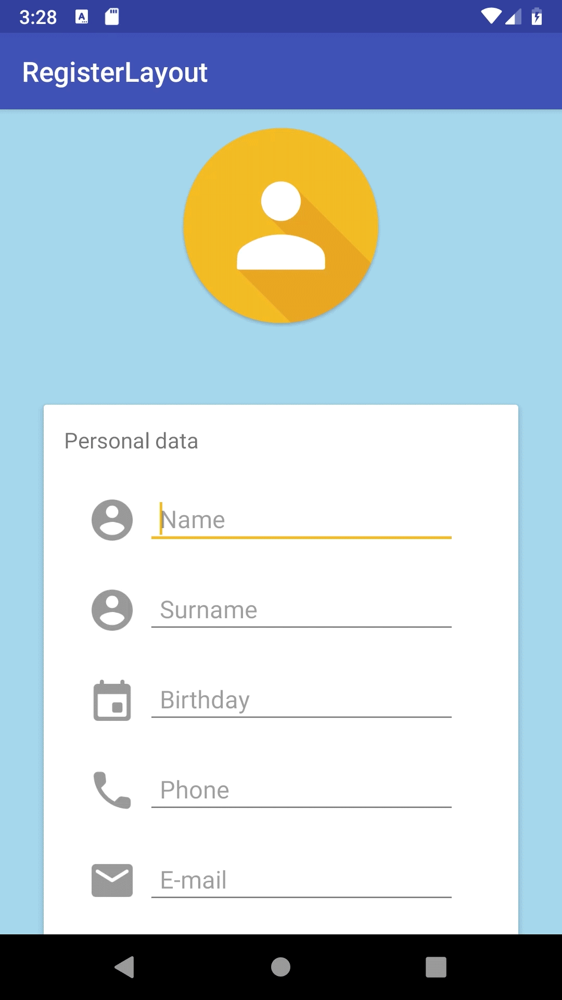

<h1>Register layout design</h1>
<h3>Android (Kotlin), well it's all XML</h3>
<b>Main tools</b>
<ul>
<li>ScrollView</li>
<li>CardlView</li>
</ul>

<h1>Description</h1>

Design of a simple register layout. It's static

Academic demo app, this app is not completely debugged, it's just a demo. It could contain not extracted text strings and not properly indented code

<h1>Screenshots</h1>

  
  

<h1>Demo *</h1>

*A higher quality and longer video opens on YouTube when clicked

  

<h1>License</h1>

This repo acts like a portfolio and the app contained here <b>can't hold liability neither place warranty</b>. Furthermore, the final porpouse of this app is not decided yet, so in order to avoid problems in the future this repo has a <b>NonCommercial</b> CC-BY-NC license

 This work is licensed under a <a rel="license" href="http://creativecommons.org/licenses/by-nc-nd/4.0/">Creative Commons Attribution-NonCommercial-NoDerivatives 4.0 International License</a>.

