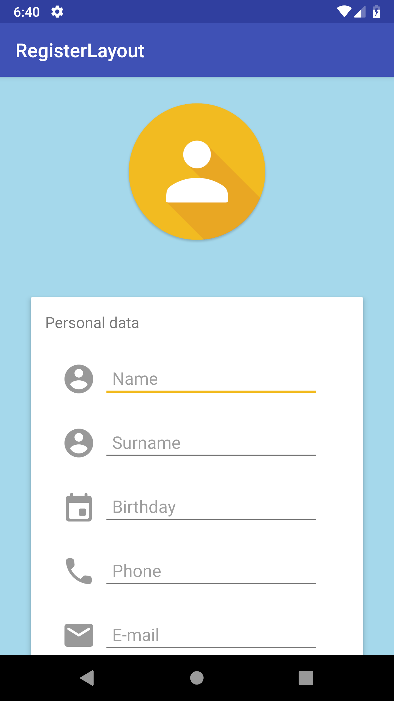
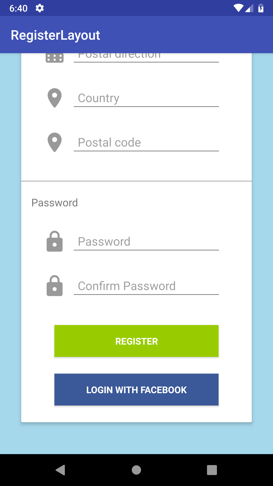

<h1>Register layout design</h1> 
<h3>Android (Kotlin), well it's all XML</h3>
<b>Main tools</b>
<ul>
<li>ScrollView</li>
</ul>

<h1>Description</h1>

Design of a simple register layout. It's static

Academic demo app, this app is not completely debugged, it's just a demo. It could contain not extracted Strings and not indented code

<h1>Screenshots</h1>

  
  

<h1>Demo</h1>

  

